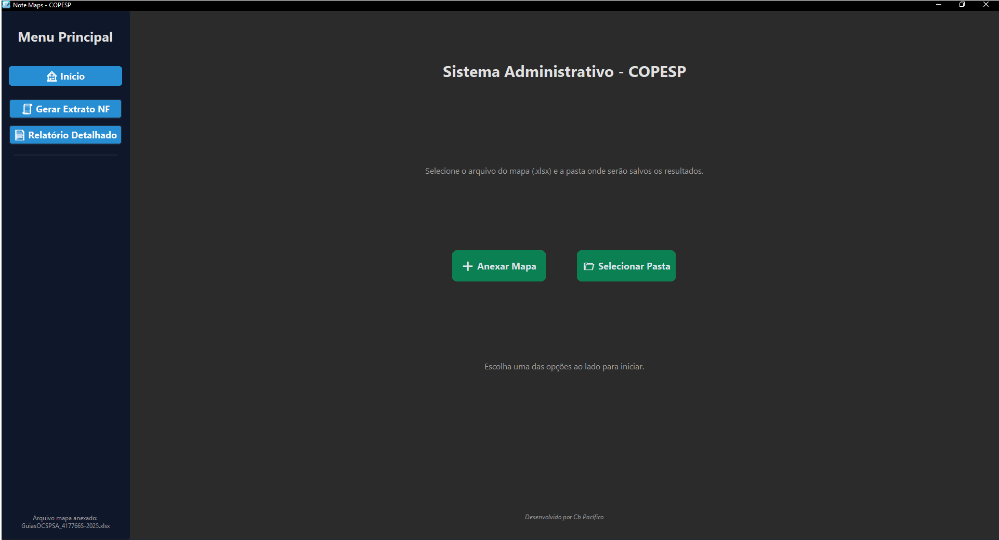
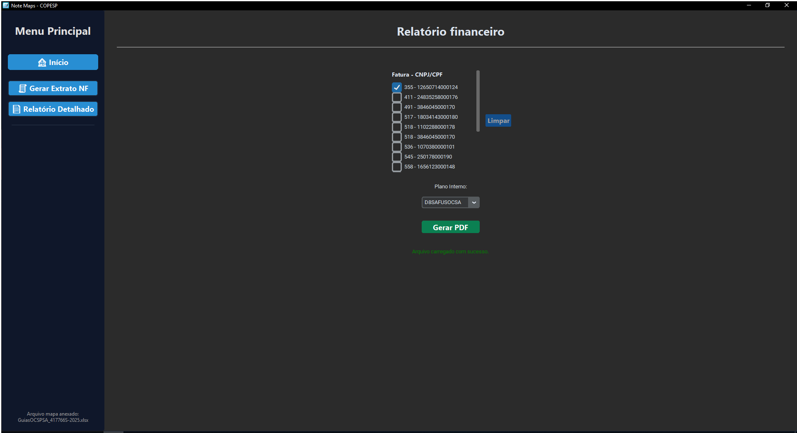
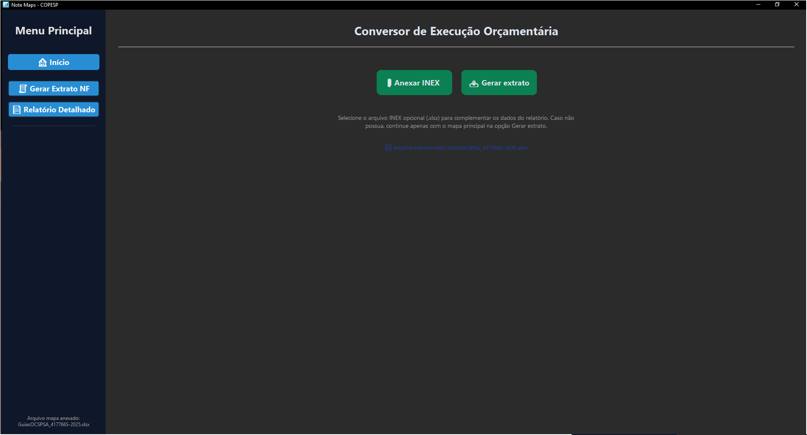

# 🗺️ Note_Maps

Sistema desktop desenvolvido com Python e CustomTkinter para leitura e conversão de planilhas da DPGO, facilitando a solicitação de Notas Fiscais no ambiente COPESP.

---

## 📌 Visão Geral

O **Note_Maps** foi criado para otimizar o processo de análise de planilhas utilizadas pela Seção Administrativa da Base Administrativa do COPESP.  
Com uma interface intuitiva, o aplicativo permite importar arquivos Excel, aplicar filtros e gerar relatórios em PDF de forma prática e eficiente.

---

## 🖼️ Imagens do Projeto

<p float="left">
  
  
  
</p>

---

## 🚀 Funcionalidades

- 📥 Importação de arquivos Excel (.xlsx)
- 🔍 Aplicação de filtros para análise personalizada dos dados
- 🧾 Geração de relatórios organizados em PDF
- 🤖 Detecção automática entre CNPJ e CPF
- 🎨 Interface responsiva e moderna com CustomTkinter
- ✅ Compatível com planilhas padrão da DPGO (.xlsx)

---

## 💻 Tecnologias Utilizadas

- Python 3.13.5  
- CustomTkinter (interface gráfica)
- Pandas (manipulação de dados)
- FPDF (criação de arquivos PDF)
- Tkinter (interação com sistema e diálogos)

---

## 🛠️ Como Usar

1. Clone este repositório:

```bash
git clone https://github.com/Jedaigodx/Note_Maps.git
cd Note_Maps
```

2. Instale as bibliotecas necessárias:

```bash
pip install pandas fpdf customtkinter
```

3. Execute o aplicativo:

```bash
python main.py
```

---

## 📂 Estrutura de Arquivos

```
Note_Maps/

├── assets/              # Imagens e ícones da interface
├── src/                 # Código-fonte principal
│   ├── main.py          # Interface principal da aplicação
│   ├── conversor.py     # Funções de leitura e formatação da planilha
│   └── gerador.py       # Funções para geração de PDF
└── README.md            # Documentação do projeto
```

---

## 👨‍💻 Desenvolvedor

Desenvolvido por **Thallisson Henrique**  
📍 Auxiliar Financeiro – Seção de Auditoria / COPESP  
🎓 Cursando Análise e Desenvolvimento de Sistemas  
📧 thallisson.h.tp@gmail.com 

---

## 📃 Licença

Este projeto está licenciado sob a **MIT License**.  
Você pode copiar, modificar, distribuir e usar livremente, com atribuição ao autor.

---

## ⭐ Contribuições

Contribuições são bem-vindas!  
Se quiser sugerir melhorias ou reportar bugs, abra uma [issue](https://github.com/Jedaigodx/Note_Maps/issues) ou envie um pull request.

---